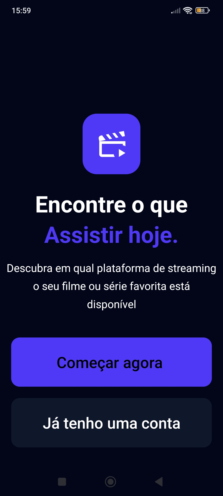
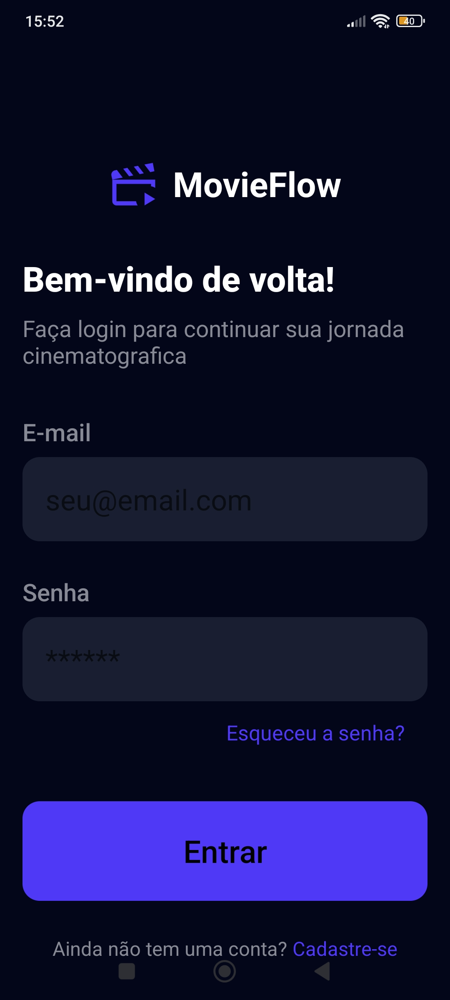
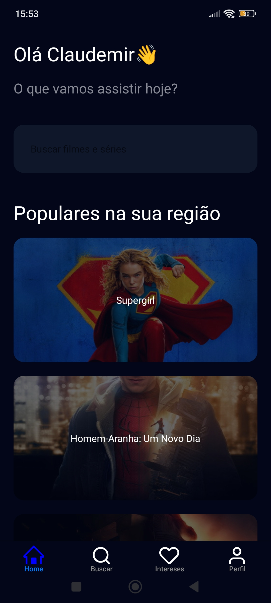
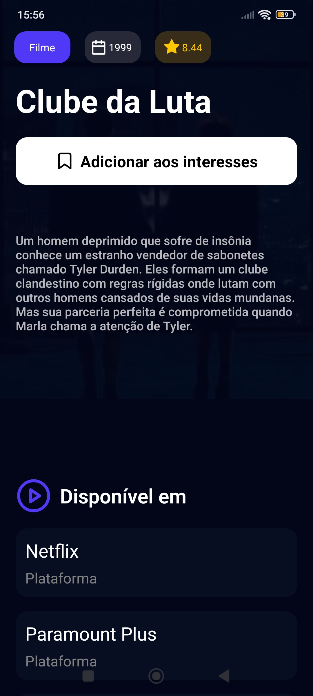
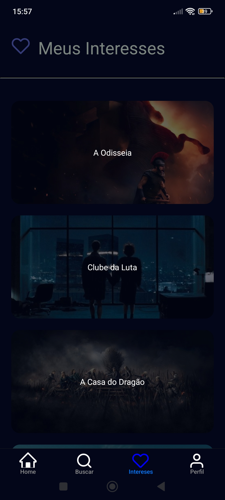
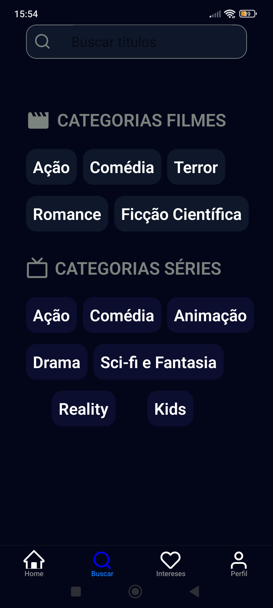

# 🎬 Movie Flow

Aplicativo mobile desenvolvido para pesquisar filmes e séries e descobrir em quais plataformas de streaming eles estão disponíveis.

O principal objetivo deste projeto foi aprofundar os conhecimentos em autenticação com JWT, integração entre frontend e backend e consumo de APIs externas.

---

# 📱 Demonstração

    
    
    
    
    
    
    

---

# 🚀 Funcionalidades

* Cadastro de usuários
* Login com autenticação JWT
* Armazenamento seguro do token de acesso
* Pesquisa de filmes e séries
* Visualização dos detalhes de filmes e séries
* Consulta das plataformas de streaming disponíveis
* Lista personalizada de interesses
* Edição das informações do usuário
* Exclusão de conta
* Logout seguro

---

# 🛠 Tecnologias Utilizadas

## Mobile

* React Native
* Expo
* JavaScript

## Backend

* Node.js
* Express

## Banco de Dados

* MySQL

## Autenticação e Segurança

* JSON Web Token (JWT)
* bcrypt
* Expo SecureStore

## APIs Externas

* TMDB (The Movie Database)
* Watchmode API

---

# 🏛 Arquitetura

O projeto foi dividido em duas aplicações:

## Frontend (Mobile)

Responsável pela interface da aplicação, autenticação do usuário e consumo da API desenvolvida em Node.js.

O token JWT é armazenado utilizando o **Expo SecureStore**, garantindo que as informações sensíveis do usuário permaneçam protegidas no dispositivo.

## Backend

Desenvolvido utilizando **Node.js** e **Express**, sendo responsável por:

* autenticação dos usuários;
* geração e validação dos tokens JWT;
* criptografia das senhas utilizando **bcrypt**;
* comunicação com o banco de dados MySQL;
* integração com as APIs TMDB e Watchmode.

---

# 🔗 APIs Utilizadas

### TMDB

Responsável por fornecer informações sobre filmes e séries, como:

* título;
* descrição;
* avaliação;
* imagens;
* data de lançamento;
* gêneros.

### Watchmode

Utilizada para consultar em quais plataformas de streaming um filme ou série está disponível.

---

# 🎯 Objetivos do Projeto

Este projeto foi desenvolvido com o propósito de consolidar conhecimentos em desenvolvimento mobile e backend, principalmente nos seguintes temas:

* autenticação utilizando JWT;
* criptografia de senhas com bcrypt;
* armazenamento seguro de informações utilizando SecureStore;
* integração entre React Native e Node.js;
* consumo de APIs REST;
* integração simultânea com múltiplas APIs externas;
* organização de uma aplicação Full Stack.

---

# 📈 Aprendizados

Durante o desenvolvimento deste projeto foi possível adquirir experiência prática em:

* desenvolvimento Full Stack;
* autenticação baseada em tokens;
* proteção de rotas;
* armazenamento seguro de credenciais;
* consumo de APIs externas;
* organização de uma API REST;
* integração entre banco de dados, backend e aplicação mobile.

---

# 👨‍💻 Autor

Desenvolvido por **Claudemir Junior**.
